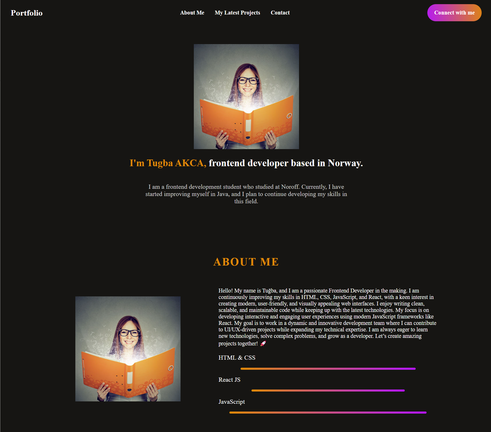

# My Portfolyo



## Description
This is my portfolio showcasing my student work for the final year of my two-year studies into front-end development. It displays my skills and abilities as well as a way to contact me should there be interest.

## Projects include:
- **My final exam** - Project-Exam-2-main
- **My Course Assignment in JavaScript Frameworks** 
- **My Semester Project 2** - EstateBid

## Built With:
- React.js

---

## Getting Started:

### Installing

Clone the repo:
```sh
git clone https://github.com/TGBAKC/Portfolyo-2.git
```

Install the dependencies:
```sh
npm install
```

### Running
```sh
npm run dev
```

---

## Contributing
I do not want contributions to my portfolio.

---

## Contact
[tugbakca47@gmail.com](#)

---

## License
ISC

---

## Acknowledgments
A big thank you to my tutors and peers for their support, guidance, and encouragement throughout my journey. Your help has meant a lot to me!
